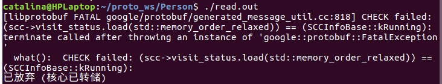
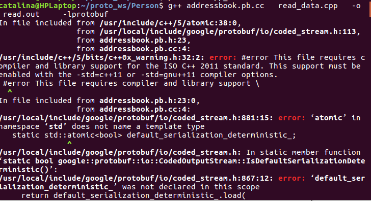

g++ addressbook.pb.cc read_data.cpp -o read.out -lprotobuf -std=c++11   -lpthread
g++ addressbook.pb.cc write_data.cpp -o write.out -lprotobuf  -std=c++11  -lpthread

遇到以下报错

解决办法：添加-lpthread

解决办法：添加-std=c++11